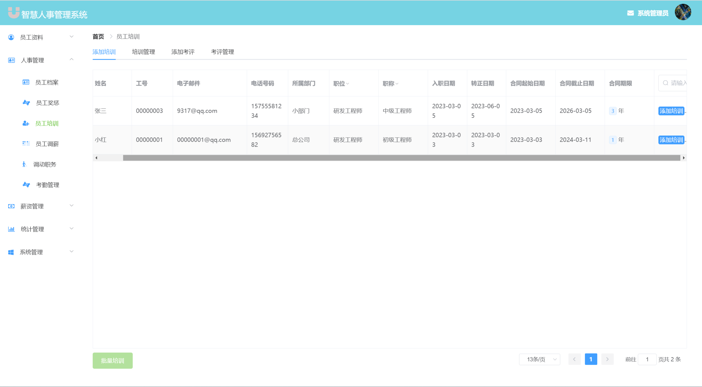
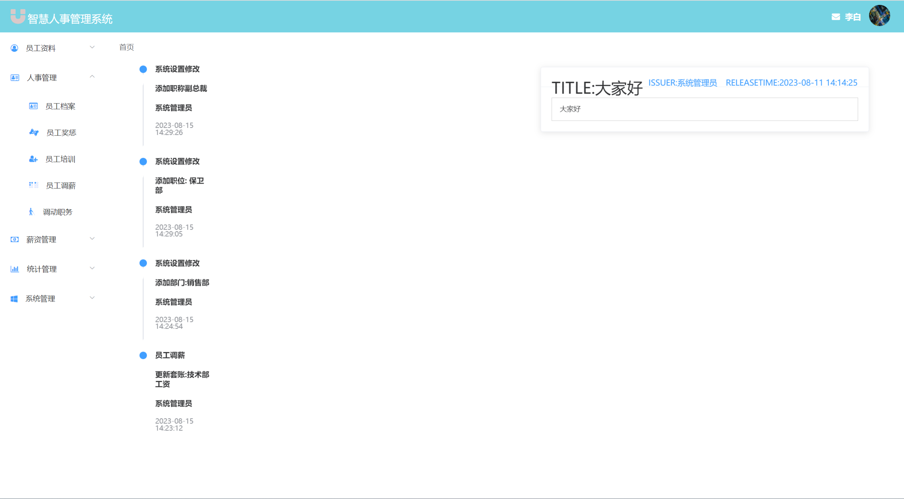

### 作者QQ：1556708905(支持修改、 部署调试、 支持代做毕设)

#### 支持代做任何毕设论、接网站建设、小程序、H5、APP、各种系统等

**毕业设计所有选题地址 [https://github.com/zhengjianzhong0107/allProject](https://github.com/zhengjianzhong0107/allProject)**

**博客地址：
[https://blog.csdn.net/2303_76227485/article/details/132298990](https://blog.csdn.net/2303_76227485/article/details/132298990)**

**视频演示：
[https://www.bilibili.com/video/BV1sh4y1S7kB/](https://www.bilibili.com/video/BV1sh4y1S7kB/)**

 

## 基于Java+Springboot+Vue的人事管理系统(源码+数据库+8000字论文)094

## 一、系统介绍

本系统前后端分离

本系统分为管理员、HR、员工三种角色

用户角色包含以下功能：

- 登录、个人培训、个人奖惩、个人调动、员工打卡、个人中心、密码修改、在线聊天

HR角色包含以下功能：

- 登录、员工档案、员工奖惩、员工培训、职务调动、考勤管理、工资套账管理、工资管理、综合信息统计、员工积分统计、人事信息统计、人事记录统计
- 部门管理、职位管理、职称管理、奖惩管理、权限角色管理、公告管理、操作员管理、操作日志管理、个人中心、密码修改、在线聊天

管理员角色包含以下功能：

- 包括用户和HR所有功能

## 二、所用技术

后端技术栈：

- Springboot
- SpringMvc
- mybatis
- mysql
- websocket
- SpringSecurity
- redis、RabbitMq(两个可选)

前端技术栈：

- Vue
- Vue-router
- axios
- element-ui

## 三、环境介绍

基础环境 :IDEA/eclipse, JDK 1.8, Mysql5.7及以上,tomcat8,Node.js(14.21),Maven3.6

所有项目以及源代码本人均调试运行无问题 可支持远程调试运行

## 四、页面截图

论文目录截图

### 1、管理员页面

### 2、用户页面

### 3、HR页面

## 五、浏览地址

- 后台访问路径：http://localhost:8080/
  
  账号密码：
- 管理员  admin/123
- HR     libai/123
- 用户    小白/123

## 六、安装教程

1. 使用Navicat或者其它工具，在mysql中创建对应名称的数据库，并执行项目的sql文件里面的sql

2. 使用IDEA/Eclipse导入hros-main项目，导入时，若为maven项目请选择maven; 等待依赖下载完成

3. 修改application.properties里面的redis配置和数据库配置

4. vscode或idea打开HROS-UI-master项目

5. 在编译器中打开terminal，执行npm install 依赖下载完成后执行 npm run serve,执行成功后会显示访问地址
